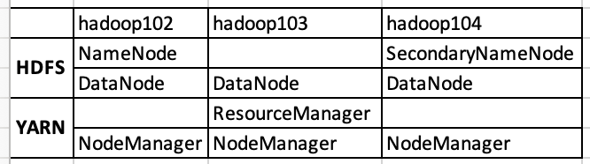

[TOC]
### 0.前序
关于学习的掌握法:七问分析法(5w2h)--->三问学习法(2w1h)


5W2H分析法又叫七问分析法，是二战中美国陆军兵器修理部首创。简单、方便，易于理解、使用，富有启发意义，广泛用于企业管理和技术活动，对于决策和执行性的活动措施也非常有帮助，也有助于弥补考虑问题的疏漏。

发明者用五个以W开头的英语单词和两个以H开头的英语单词进行设问，发现解决问题的线索，寻找发明思路，进行设计构思，从而搞出新的发明项目，这就叫做5W2H法。

（1）WHAT——是什么？目的是什么？做什么工作？

（2）WHY——为什么要做？可不可以不做？有没有替代方案？

（3）WHO——谁？由谁来做？

（4）WHEN——何时？什么时间做？什么时机最适宜？

（5）WHERE——何处？在哪里做？

（6）HOW ——怎么做？如何提高效率？如何实施？方法是什么？

（7）HOW MUCH——多少？做到什么程度？数量如何？质量水平如何？费用产出如何  

***简单些，也就是最为核心的，就变为了2W1H分析法***  
1、是什么？ what  
2、为什么？ why  
3、怎么办？ how  

### 1.初识大数据--大数据是什么
#### 1.1.认识大数据
大数据（Big Data）：指无法在一定时间范围内用常规软件工具进行捕捉、管理和处理的数据集合，是需要新处理模式才能具有更强的决策力、洞察发现力和流程优化能力的海量、高增长率和多样化的信息资产。

按顺序给出数据存储单位：bit、Byte、KB、MB、GB、TB、PB、EB、ZB、YB、BB、NB、DB。

主要解决，海量数据的存储和海量数据的分析计算问题


#### 1.2 大数据特点（4V）
* Volume（大量）
  截至目前，人类生产的所有印刷材料的数据量是200PB，而历史上全人类总共说过的话的数据量大约是5EB。当前，典型个人计算机硬盘的容量为TB量级，而一些大企业的数据量已经接近EB量级。

* Velocity（高速）
  这是大数据区分于传统数据挖掘的最显著特征。根据IDC的“数字宇宙”的报告，预计到2020年，全球数据使用量将达到35.2ZB。在如此海量的数据面前，处理数据的效率就是企业的生命。
  天猫双十一：2017年3分01秒，天猫交易额超过100亿
  

* Variety（多样）
  这种类型的多样性也让数据被分为结构化数据和非结构化数据。相对于以往便于存储的以数据库/文本为主的结构化数据，非结构化数据越来越多，包括网络日志、音频、视频、图片、地理位置信息等，这些多类型的数据对数据的处理能力提出了更高要求。

  

* Value（低价值密度）
  价值密度的高低与数据总量的大小成反比。


***==如何快速对有价值数据“提纯”成为目前大数据背景下待解决的难题==***

#### 1.3 大数据应用场景
1. 物流仓储：大数据分析系统助力商家精细化运营、提升销量、节约成本

2. 零售：分析用户消费习惯，为用户购买商品提供方便，从而提升商品销量。经典案例，纸尿布+啤酒。

3. 旅游：深度结合大数据能力与旅游行业需求，共建旅游产业智慧管理、智慧服务和智慧营销的未来。

   

4. 商品广告推荐：给用户推荐可能喜欢的商品、电影

5. 人工智能


#### 1.4 大数据部门组织结构 


### 2.认识大数据--Hadoop是什么

#### 2.1 Hadoop是什么

1）Hadoop是一个由Apache基金会所开发的分布式系统基础架构。
2）主要解决，海量数据的存储和海量数据的分析计算问题。
3）广义上来说，Hadoop通常是指一个更广泛的概念——Hadoop生态圈。
#### 2.2 Hadoop的发展历史
1）Lucene框架是Doug Cutting开创的开源软件，用Java书写代码，实现与Google类似的全文搜索功能，它提供了全文检索引擎的架构，包括完整的查询引擎和索引引擎。
  
2）2001年年底Lucene成为Apache基金会的一个子项目。  
3）对于海量数据的场景，Lucene面对与Google同样的困难，存储数据困难，检索速度慢。  
4）学习和模仿Google解决这些问题的办法 ：微型版Nutch。  
5）可以说Google是Hadoop的思想之源(Google在大数据方面的三篇论文)  
&emsp;&emsp;GFS --->HDFS
&emsp;&emsp;Map-Reduce --->MR
&emsp;&emsp;BigTable --->HBase
6）2003-2004年，Google公开了部分GFS和MapReduce思想的细节，以此为基础Doug Cutting等人用了2年业余时间实现了DFS和MapReduce机制，使Nutch性能飙升。
7）2005 年Hadoop 作为 Lucene的子项目 Nutch的一部分正式引入Apache基金会。
8）2006 年 3 月份，Map-Reduce和Nutch Distributed File System (NDFS) 分别被纳入称为 Hadoop 的项目中。
9）名字来源于Doug Cutting儿子的玩具大象

10）Hadoop就此诞生并迅速发展，标志着大数据时代来临。
#### 2.3 Hadoop三大发行版本
Hadoop三大发行版本：Apache、Cloudera、Hortonworks。
Apache版本最原始（最基础）的版本，对于入门学习最好。
Cloudera在大型互联网企业中用的较多。
Hortonworks文档较好。
1. Apache Hadoop
官网地址：http://hadoop.apache.org/releases.html
下载地址：https://archive.apache.org/dist/hadoop/common/
2. Cloudera Hadoop 
官网地址：https://www.cloudera.com/downloads/cdh/5-10-0.html
下载地址：http://archive-primary.cloudera.com/cdh5/cdh/5/
（1）2008年成立的Cloudera是最早将Hadoop商用的公司，为合作伙伴提供Hadoop的商用解决方案，主要是包括支持、咨询服务、培训。
（2）2009年Hadoop的创始人Doug Cutting也加盟Cloudera公司。Cloudera产品主要为CDH，Cloudera Manager，Cloudera Support
（3）CDH是Cloudera的Hadoop发行版，完全开源，比Apache Hadoop在兼容性，安全性，稳定性上有所增强。
（4）Cloudera Manager是集群的软件分发及管理监控平台，可以在几个小时内部署好一个Hadoop集群，并对集群的节点及服务进行实时监控。Cloudera Support即是对Hadoop的技术支持。
（5）Cloudera的标价为每年每个节点4000美元。Cloudera开发并贡献了可实时处理大数据的Impala项目。
3. Hortonworks Hadoop
官网地址：https://hortonworks.com/products/data-center/hdp/
下载地址：https://hortonworks.com/downloads/#data-platform
（1）2011年成立的Hortonworks是雅虎与硅谷风投公司Benchmark Capital合资组建。
（2）公司成立之初就吸纳了大约25名至30名专门研究Hadoop的雅虎工程师，上述工程师均在2005年开始协助雅虎开发Hadoop，贡献了Hadoop80%的代码。
（3）雅虎工程副总裁、雅虎Hadoop开发团队负责人Eric Baldeschwieler出任Hortonworks的首席执行官。
（4）Hortonworks的主打产品是Hortonworks Data Platform（HDP），也同样是100%开源的产品，HDP除常见的项目外还包括了Ambari，一款开源的安装和管理系统。
（5）HCatalog，一个元数据管理系统，HCatalog现已集成到Facebook开源的Hive中。Hortonworks的Stinger开创性的极大的优化了Hive项目。Hortonworks为入门提供了一个非常好的，易于使用的沙盒。
（6）Hortonworks开发了很多增强特性并提交至核心主干，这使得Apache Hadoop能够在包括Window Server和Windows Azure在内的Microsoft Windows平台上本地运行。定价以集群为基础，每10个节点每年为12500美元。
#### 2.4 Hadoop的优势（4高）
1）高可靠性：Hadoop底层维护多个数据副本，所以即使Hadoop某个计算元素或存储出现故障，也不会导致数据的丢失。
2）高扩展性：在集群间分配任务数据，可方便的扩展数以千计的节点。
3）高效性：在MapReduce的思想下，Hadoop是并行工作的，以加快任务处理速度。
4）高容错性：能够自动将失败的任务重新分配。
#### 2.5 Hadoop组成

HDFS：Hadoop Distributed File System Hadoop
分布式文件系统
YARN：Yet Another Resource Negotiator 
意思是“另一种资源调度器”，这种命名和“有间客栈”这种可谓是异曲同工之妙。)
MR：Map Reduce 
计算的两种过程
&emsp;Map阶段并行处理输入数据
&emsp;Reduce阶段对Map结果进行汇总
#### 2.4 大数据技术生态体系


### 3.Hadoop运行模式 
Hadoop运行模式包括：本地模式、伪分布式模式以及完全分布式模式。
Hadoop官方网站：http://hadoop.apache.org/
#### 3.1 本地运行模式
##### 3.1.1 官方Grep案例
1. 在hadoop根目录下创建一个input文件夹
```shell
cd /opt/module/hadoop-2.7.2/
mkdir input
```
2. 将Hadoop的xml配置文件复制到input
```shell
cp etc/hadoop/*.xml input
```
3. 执行share目录下的MapReduce程序
```shell
bin/hadoop jar share/hadoop/mapreduce/hadoop-mapreduce-examples-2.7.2.jar grep input output 'dfs[a-z.]+'
```
4. 查看输出结果
```shell
cat output/*
```
##### 3.1.2 官方WordCount案例
1. 在hadoop根目录下创建一个wcinput文件夹
2. 在wcinput文件下创建一个wc.input文件
3. 编辑wc.input文件，插入内容
```vim
hadoop yarn
hadoop mapreduce
zookeeper
hive spark
spark
```
4. 回到根目录下
5. 执行指令
```shell
hadoop jar share/hadoop/mapreduce/hadoop-mapreduce-examples-2.7.2.jar wordcount wcinput wcoutput
```
6. 查看输出结果
```shell
cat wcoutput/part-r-00000
```
#### 3.2 分布式模式
伪分布式模式、完全分布式模式
伪分布式搭建：<https://blog.csdn.net/qq_30158837/article/details/78289813>

完全分布式：

启动的Java进程



1. web端查看HDFS文件系统-->端口号50070
http://hadoop102:50070/
2. YARN的浏览器页面查看 -->端口号8088
http://hadoop103:8088/
3. 查看产生的Log日志 
    根目录下的logs目录
4. 操作集群

（a）在HDFS文件系统上创建一个input文件夹
```shell
bin/hdfs dfs -mkdir -p /user/marcel/input
```
（b）将测试文件内容上传到文件系统(HDFS)上
```shell
bin/hdfs dfs -put wcinput/wc.input /user/marcel/input/
```
（c）查看上传的文件是否正确
```shell
bin/hdfs dfs -ls  /user/marcel/input/
bin/hdfs dfs -cat  /user/marcel/ input/wc.input
```
（d）运行MapReduce程序
```shell
bin/hadoop jar share/hadoop/mapreduce/hadoop-mapreduce-examples-2.7.2.jar wordcount /user/marcel/input/ /user/marcel/output
```
（e）查看输出结果
```shell
bin/hdfs dfs -cat /user/marcel/output/*
```
5. 查看JobHistory
    http://hadoop102:19888/jobhistory

### 4.HDFS
#### 4.1 HDFS是什么
1. HDFS产生背景
随着数据量越来越大，在一个操作系统存不下所有的数据，那么就分配到更多的操作系统管理的磁盘中，但是不方便管理和维护，迫切需要一种系统来管理多台机器上的文件，这就是分布式文件管理系统。HDFS只是分布式文件管理系统中的一种。
2. HDFS定义
**HDFS**（Hadoop Distributed File System），它是一个文件系统，用于存储文件，通过目录树来定位文件；其次，它是分布式的，由很多服务器联合起来实现其功能，集群中的服务器有各自的角色。  
**使用场景**：适合一次写入，多次读出的场景，且不支持文件的修改。适合用来做数据分析，并不适合用来做网盘应用。
#### 4.2 HDFS优缺点
##### 4.2.1 优点
1）高容错性
（1）数据自动保存多个副本。它通过增加副本的形式，提高容错性。

（2）某一个副本丢失以后，它可以自动恢复。 

2）适合处理大数据 
（1）数据规模：能够处理数据规模达到GB、TB、甚至PB级别的数据；
（2）文件规模：能够处理百万规模以上的文件数量，数量相当之大。
3）可构建在廉价机器上，通过多副本机制，提高可靠性。
##### 4.2.2 缺点
1）不适合低延时数据访问，比如毫秒级的存储数据，是做不到的。
2）无法高效的对大量小文件进行存储。
（1）存储大量小文件的话，它会占用NameNode大量的内存来存储文件目录和块信息。这样是不可取的，因为NameNode的内存总是有限的；
（2）小文件存储的寻址时间会超过读取时间，它违反了HDFS的设计目标。
3）不支持并发写入、文件随机修改。
（1）一个文件只能有一个写，不允许多个线程同时写；
（2）仅支持数据append（追加），不支持文件的随机修改。

#### 4.3 HDFS组成架构

HDFS 采用Master/Slave的架构来存储数据，这种架构主要由四个部分组成，分别为HDFS Client、NameNode、DataNode和Secondary NameNode。下面我们分别介绍这四个组成部分。

1. Client：就是客户端。

* 文件切分。文件上传 HDFS 的时候，Client 将文件切分成 一个一个的Block，然后进行存储。
* 与 NameNode 交互，获取文件的位置信息。
* 与 DataNode 交互，读取或者写入数据。
* Client 提供一些命令来管理 HDFS，比如启动或者关闭HDFS。
* Client 可以通过一些命令来访问 HDFS。
2. NameNode：就是 master，它是一个主管、管理者。
* 管理 HDFS 的名称空间。
* 管理数据块（Block）映射信息
* 配置副本策略
* 处理客户端读写请求。
3. DataNode：就是Slave。NameNode 下达命令，DataNode 执行实际的操作。
* 存储实际的数据块。
* 执行数据块的读/写操作。
4. Secondary NameNode：并非 NameNode 的热备。当NameNode 挂掉的时候，它并不能马上替换 NameNode 并提供服务。
* 辅助 NameNode，分担其工作量。
* 定期合并 fsimage和fsedits，并推送给NameNode。
* 在紧急情况下，可辅助恢复 NameNode。
#### 4.4 HDFS文件块大小
HDFS中的文件在物理上是分块存储（Block），块的大小可以通过配置参数( dfs.blocksize)来规定，默认大小在Hadoop2.x版本中是128M，老版本中是64M。


==思考：为什么块的大小不能设置太小，也不能设置太大？==

### 5.HDFS的Shell操作
#### 5.1 基本语法
bin/hadoop fs 具体命令   OR  bin/hdfs dfs 具体命令
dfs是fs的实现类
#### 5.2 基本语法
```shell
        [-appendToFile <localsrc> ... <dst>]
        [-cat [-ignoreCrc] <src> ...]
        [-checksum <src> ...]
        [-chgrp [-R] GROUP PATH...]
        [-chmod [-R] <MODE[,MODE]... | OCTALMODE> PATH...]
        [-chown [-R] [OWNER][:[GROUP]] PATH...]
        [-copyFromLocal [-f] [-p] <localsrc> ... <dst>]
        [-copyToLocal [-p] [-ignoreCrc] [-crc] <src> ... <localdst>]
        [-count [-q] <path> ...]
        [-cp [-f] [-p] <src> ... <dst>]
        [-createSnapshot <snapshotDir> [<snapshotName>]]
        [-deleteSnapshot <snapshotDir> <snapshotName>]
        [-df [-h] [<path> ...]]
        [-du [-s] [-h] <path> ...]
        [-expunge]
        [-get [-p] [-ignoreCrc] [-crc] <src> ... <localdst>]
        [-getfacl [-R] <path>]
        [-getmerge [-nl] <src> <localdst>]
        [-help [cmd ...]]
        [-ls [-d] [-h] [-R] [<path> ...]]
        [-mkdir [-p] <path> ...]
        [-moveFromLocal <localsrc> ... <dst>]
        [-moveToLocal <src> <localdst>]
        [-mv <src> ... <dst>]
        [-put [-f] [-p] <localsrc> ... <dst>]
        [-renameSnapshot <snapshotDir> <oldName> <newName>]
        [-rm [-f] [-r|-R] [-skipTrash] <src> ...]
        [-rmdir [--ignore-fail-on-non-empty] <dir> ...]
        [-setfacl [-R] [{-b|-k} {-m|-x <acl_spec>} <path>]|[--set <acl_spec> <path>]]
        [-setrep [-R] [-w] <rep> <path> ...]
        [-stat [format] <path> ...]
        [-tail [-f] <file>]
        [-test -[defsz] <path>]
        [-text [-ignoreCrc] <src> ...]
        [-touchz <path> ...]
        [-usage [cmd ...]]
```
### 6.HDFS客户端操作

#### 6.1 HDFS客户端环境准备
1. 根据自己电脑的操作系统拷贝对应的编译后的hadoop jar包到非中文路径（例如：D:\Develop\hadoop-2.7.2）
2. 配置HADOOP_HOME环境变量

3. 配置Path环境变量

4. 创建一个Maven工程HdfsClientDemo
5. 导入相应的依赖坐标+日志添加
```xml
<dependencies>
		<dependency>
			<groupId>junit</groupId>
			<artifactId>junit</artifactId>
			<version>RELEASE</version>
		</dependency>
		<dependency>
			<groupId>org.apache.logging.log4j</groupId>
			<artifactId>log4j-core</artifactId>
			<version>2.8.2</version>
		</dependency>
		<dependency>
			<groupId>org.apache.hadoop</groupId>
			<artifactId>hadoop-common</artifactId>
			<version>2.7.2</version>
		</dependency>
		<dependency>
			<groupId>org.apache.hadoop</groupId>
			<artifactId>hadoop-client</artifactId>
			<version>2.7.2</version>
		</dependency>
		<dependency>
			<groupId>org.apache.hadoop</groupId>
			<artifactId>hadoop-hdfs</artifactId>
			<version>2.7.2</version>
		</dependency>
		<dependency>
			<groupId>jdk.tools</groupId>
			<artifactId>jdk.tools</artifactId>
			<version>1.8</version>
			<scope>system</scope>
			<systemPath>${JAVA_HOME}/lib/tools.jar</systemPath>
		</dependency>
</dependencies>
```
**输出日志：**
需要在项目的src/main/resources目录下，新建一个文件，命名为“log4j.properties”，在文件中填入
```properties
log4j.rootLogger=INFO, stdout
log4j.appender.stdout=org.apache.log4j.ConsoleAppender
log4j.appender.stdout.layout=org.apache.log4j.PatternLayout
log4j.appender.stdout.layout.ConversionPattern=%d %p [%c] - %m%n
log4j.appender.logfile=org.apache.log4j.FileAppender
log4j.appender.logfile.File=target/spring.log
log4j.appender.logfile.layout=org.apache.log4j.PatternLayout
log4j.appender.logfile.layout.ConversionPattern=%d %p [%c] - %m%n
```
6. 创建HdfsClient类
```java
public class HdfsClient{	
@Test
public void testMkdirs() throws IOException, InterruptedException, URISyntaxException{
		
		// 1 获取文件系统
		Configuration configuration = new Configuration();
		// 配置在集群上运行
		// configuration.set("fs.defaultFS", "hdfs://hadoop102:9000");
		// FileSystem fs = FileSystem.get(configuration);

		FileSystem fs = FileSystem.get(new URI("hdfs://hadoop102:9000"), configuration, "marcel");
		
		// 2 创建目录
		fs.mkdirs(new Path("/upload1"));
		
		// 3 关闭资源
		fs.close();
	}
}
```
#### 6.2 HDFS的API操作
##### 6.2.1 HDFS文件上传（测试参数优先级）
1. 编写源代码
```java
@Test
public void testCopyFromLocalFile() throws IOException, InterruptedException, URISyntaxException {

		// 1 获取文件系统
		Configuration configuration = new Configuration();
		configuration.set("dfs.replication", "2");
		FileSystem fs = FileSystem.get(new URI("hdfs://hadoop102:9000"), configuration, "marcel");

		// 2 上传文件
		fs.copyFromLocalFile(new Path("e:/banzhang.txt"), new Path("/upload1/input/wordcount.txt"));

		// 3 关闭资源
		fs.close();

		System.out.println("over");
}
```
2. 将hdfs-site.xml拷贝到项目的根目录下
```xml
<?xml version="1.0" encoding="UTF-8"?>
<?xml-stylesheet type="text/xsl" href="configuration.xsl"?>

<configuration>
	<property>
		<name>dfs.replication</name>
        <value>1</value>
	</property>
</configuration>
```
3. 参数优先级
参数优先级排序：（1）客户端代码中设置的值 >（2）ClassPath下的用户自定义配置文件 >（3）然后是服务器的默认配置
##### 6.2.2 HDFS文件下载
```java
@Test
public void testCopyToLocalFile() throws IOException, InterruptedException, URISyntaxException{

		// 1 获取文件系统
		Configuration configuration = new Configuration();
		FileSystem fs = FileSystem.get(new URI("hdfs://hadoop102:9000"), configuration, "marcel");
		
		// 2 执行下载操作
		// boolean delSrc 指是否将原文件删除
		// Path src 指要下载的文件路径
		// Path dst 指将文件下载到的路径
		// boolean useRawLocalFileSystem 是否开启文件校验
		fs.copyToLocalFile(false, new Path("/upload1/input/wordcount.txt"), new Path("e:/wordcount1.txt"), true);
		
		// 3 关闭资源
		fs.close();
}
```
##### 6.2.3 HDFS文件夹删除
```java
@Test
public void testDelete() throws IOException, InterruptedException, URISyntaxException{

	// 1 获取文件系统
	Configuration configuration = new Configuration();
	FileSystem fs = FileSystem.get(new URI("hdfs://hadoop102:9000"), configuration, "marcel");
		
	// 2 执行删除
	fs.delete(new Path("/upload1/input"), true);
		
	// 3 关闭资源
	fs.close();
}
```
##### 6.2.4 HDFS文件名更改
```java
@Test
public void testRename() throws IOException, InterruptedException, URISyntaxException{

	// 1 获取文件系统
	Configuration configuration = new Configuration();
	FileSystem fs = FileSystem.get(new URI("hdfs://hadoop102:9000"), configuration, "marcel"); 
		
	// 2 修改文件名称
	fs.rename(new Path("/upload1/wordcount.txt"), new Path("/upload1/wordcount1.txt"));
		
	// 3 关闭资源
	fs.close();
}
```
##### 6.2.5 HDFS文件详情查看
查看文件名称、权限、长度、块信息
```java
@Test
public void testListFiles() throws IOException, InterruptedException, URISyntaxException{

	// 1获取文件系统
	Configuration configuration = new Configuration();
	FileSystem fs = FileSystem.get(new URI("hdfs://hadoop102:9000"), configuration, "marcel"); 
		
	// 2 获取文件详情
	RemoteIterator<LocatedFileStatus> listFiles = fs.listFiles(new Path("/"), true);
		
	while(listFiles.hasNext()){
		LocatedFileStatus status = listFiles.next();
			
		// 输出详情
		// 文件名称
		System.out.println(status.getPath().getName());
		// 长度
		System.out.println(status.getLen());
		// 权限
		System.out.println(status.getPermission());
		// 分组
		System.out.println(status.getGroup());
			
		// 获取存储的块信息
		BlockLocation[] blockLocations = status.getBlockLocations();
			
		for (BlockLocation blockLocation : blockLocations) {
				
			// 获取块存储的主机节点
			String[] hosts = blockLocation.getHosts();
				
			for (String host : hosts) {
				System.out.println(host);
			}
		}
	}

// 3 关闭资源
fs.close();
}
```
##### 6.2.6 HDFS文件和文件夹判断
```java
@Test
public void testListStatus() throws IOException, InterruptedException, URISyntaxException{
		
	// 1 获取文件配置信息
	Configuration configuration = new Configuration();
	FileSystem fs = FileSystem.get(new URI("hdfs://hadoop102:9000"), configuration, "marcel");
		
	// 2 判断是文件还是文件夹
	FileStatus[] listStatus = fs.listStatus(new Path("/"));
		
	for (FileStatus fileStatus : listStatus) {
		
		// 如果是文件
		if (fileStatus.isFile()) {
				System.out.println("f:"+fileStatus.getPath().getName());
			}else {
				System.out.println("d:"+fileStatus.getPath().getName());
			}
		}
		
	// 3 关闭资源
	fs.close();
}
```
#### 6.3 HDFS的I/O流操作
上面我们学的API操作HDFS系统都是框架封装好的。那么如果我们想自己实现上述API的操作该怎么实现呢？
可以采用IO流的方式实现数据的上传和下载。
##### 6.3.1 HDFS文件上传
1. 需求：把本地e盘上的banhua.txt文件上传到HDFS根目录
2. 编写代码
```java
@Test
public void putFileToHDFS() throws IOException, InterruptedException, URISyntaxException {

	// 1 获取文件系统
	Configuration configuration = new Configuration();
	FileSystem fs = FileSystem.get(new URI("hdfs://hadoop102:9000"), configuration, "marcel");

	// 2 创建输入流
	FileInputStream fis = new FileInputStream(new File("e:/wordcount.txt"));

	// 3 获取输出流
	FSDataOutputStream fos = fs.create(new Path("/upload1/wordcount_IO.txt"));

	// 4 流对拷
	IOUtils.copyBytes(fis, fos, configuration);

	// 5 关闭资源
	IOUtils.closeStream(fos);
	IOUtils.closeStream(fis);
    fs.close();
}
```
##### 6.3.2 HDFS文件下载
1. 需求：从HDFS上下载banhua.txt文件到本地e盘上
2. 编写代码
```java
// 文件下载
@Test
public void getFileFromHDFS() throws IOException, InterruptedException, URISyntaxException{

	// 1 获取文件系统
	Configuration configuration = new Configuration();
	FileSystem fs = FileSystem.get(new URI("hdfs://hadoop102:9000"), configuration, "marcel");
		
	// 2 获取输入流
	FSDataInputStream fis = fs.open(new Path("/upload1/wordcount_IO.txt"));
		
	// 3 获取输出流
	FileOutputStream fos = new FileOutputStream(new File("e:/wordcount1.txt"));
		
	// 4 流的对拷
	IOUtils.copyBytes(fis, fos, configuration);
		
	// 5 关闭资源
	IOUtils.closeStream(fos);
	IOUtils.closeStream(fis);
	fs.close();
}
```
##### 6.3.3 定位文件读取
1．需求：分块读取HDFS上的大文件，比如根目录下的/hadoop-2.7.2.tar.gz
2．编写代码
（1）下载第一块
```java
@Test
public void readFileSeek1() throws IOException, InterruptedException, URISyntaxException{

	// 1 获取文件系统
	Configuration configuration = new Configuration();
	FileSystem fs = FileSystem.get(new URI("hdfs://hadoop102:9000"), configuration, "marcel");
		
	// 2 获取输入流
	FSDataInputStream fis = fs.open(new Path("/hadoop-2.7.2.tar.gz"));
		
	// 3 创建输出流
	FileOutputStream fos = new FileOutputStream(new File("e:/hadoop-2.7.2.tar.gz.part1"));
		
	// 4 流的拷贝
	byte[] buf = new byte[1024];
		
	for(int i =0 ; i < 1024 * 128; i++){
		fis.read(buf);
		fos.write(buf);
	}
		
	// 5关闭资源
	IOUtils.closeStream(fis);
	IOUtils.closeStream(fos);
fs.close();
}
```
（2）下载第二块
```java
@Test
public void readFileSeek2() throws IOException, InterruptedException, URISyntaxException{

	// 1 获取文件系统
	Configuration configuration = new Configuration();
	FileSystem fs = FileSystem.get(new URI("hdfs://hadoop102:9000"), configuration, "marcel");
		
	// 2 打开输入流
	FSDataInputStream fis = fs.open(new Path("/hadoop-2.7.2.tar.gz"));
		
	// 3 定位输入数据位置
	fis.seek(1024*1024*128);
		
	// 4 创建输出流
	FileOutputStream fos = new FileOutputStream(new File("e:/hadoop-2.7.2.tar.gz.part2"));
		
	// 5 流的对拷
	IOUtils.copyBytes(fis, fos, configuration);
		
	// 6 关闭资源
	IOUtils.closeStream(fis);
	IOUtils.closeStream(fos);
}
```
（3）合并文件
在Window命令窗口中进入到目录E:\，然后执行如下命令，对数据进行合并
type hadoop-2.7.2.tar.gz.part2 >> hadoop-2.7.2.tar.gz.part1
合并完成后，将hadoop-2.7.2.tar.gz.part1重新命名为hadoop-2.7.2.tar.gz。解压发现该tar包非常完整。
### 7.HDFS的数据流
#### 7.1 HDFS写数据流程


#### 7.2 HDFS读数据流程


### 8.NameNode工作机制 
NameNode和Secondary NameNode工作机制 


### 9.HDFS HA高可用

#### 9.1 什么是HDFS HA
在hadoop2.0之前，namenode只有一个，存在单点问题（虽然hadoop1.0有secondarynamenode，checkpointnode，buckcupnode这些，但是单点问题依然存在），在hadoop2.0引入了HA机制。hadoop2.0的HA机制官方介绍了有2种方式，一种是NFS（Network File System）方式，另外一种是QJM（Quorum Journal Manager）方式。

1）所谓HA（High Available），即高可用（7*24小时不中断服务）。
2）实现高可用最关键的策略是消除单点故障。HA严格来说应该分成各个组件的HA机制：HDFS的HA和YARN的HA。
3）Hadoop2.0之前，在HDFS集群中NameNode存在单点故障（SPOF）。
4）NameNode主要在以下两个方面影响HDFS集群
	NameNode机器发生意外，如宕机，集群将无法使用，直到管理员重启
	NameNode机器需要升级，包括软件、硬件升级，此时集群也将无法使用
HDFS HA功能通过配置Active/Standby两个NameNodes实现在集群中对NameNode的热备来解决上述问题。如果出现故障，如机器崩溃或机器需要升级维护，这时可通过此种方式将NameNode很快的切换到另外一台机器。
#### 9.2 HDFS-HA工作机制

##### 9.2.1 基本原理

通过双NameNode消除单点故障
1）hadoop2.0的HA 机制有两个namenode，一个是active namenode，状态是active；另外一个是standby namenode，状态是standby。两者的状态是可以切换的，但不能同时两个都是active状态，最多只有1个是active状态。只有active namenode提供对外的服务，standby namenode是不对外服务的。active namenode和standby namenode之间通过NFS或者JN（journalnode，QJM方式）来同步数据。

2）active namenode会把最近的操作记录写到本地的一个edits文件中（edits file），并传输到NFS或者JN中。standby namenode定期的检查，从NFS或者JN把最近的edit文件读过来，然后把edits文件和fsimage文件合并成一个新的fsimage，合并完成之后会通知active namenode获取这个新fsimage。active namenode获得这个新的fsimage文件之后，替换原来旧的fsimage文件。

3）这样，保持了active namenode和standby namenode的数据的实时同步，standby namenode可以随时切换成active namenode（譬如active namenode挂了）。
==思考：HDFS配置HA之后，是否还需要Secondary NameNode？==

##### 9.2.2 2NN模式与HA模式启动服务的对比


##### 9.2.3 NFS方式
NFS作为active namenode和standby namenode之间数据共享的存储。active namenode会把最近的edits文件写到NFS，而standby namenode从NFS中把数据读过来。这个方式的缺点是，如果active namenode或者standby namenode有一个和NFS之间网络有问题，则会造成他们之前数据的同步出问题。


##### 9.2.3 QJM（Quorum Journal Manager ）方式 
QJM的方式可以解决上述NFS容错机制不足的问题。active namenode和standby namenode之间是通过一组journalnode（数量是奇数，可以是3,5,7...,2n+1）来共享数据。active namenode把最近的edits文件写到2n+1个journalnode上，只要有n+1个写入成功就认为这次写入操作成功了，然后standby namenode就可以从journalnode上读取了。可以看到，QJM方式有容错的机制，可以容忍n个journalnode的失败。


##### 9.2.4 主备节点的切换
active namenode和standby namenode可以随时切换。当active namenode挂掉后，也可以把standby namenode切换成active状态，成为active namenode。可以人工切换和自动切换。人工切换是通过执行HA管理的命令来改变namenode的状态，从standby到active，或者从active到standby。自动切换则在active namenode挂掉的时候，standby namenode自动切换成active状态，取代原来的active namenode成为新的active namenode，HDFS继续正常工作。

主备节点的自动切换需要配置zookeeper。active namenode和standby namenode把他们的状态实时记录到zookeeper中，zookeeper监视他们的状态变化。当zookeeper发现active namenode挂掉后，会自动把standby namenode切换成active namenode。


### 10.YARN HA高可用
启动的服务


### ==作业==
1. 运行Hadoop本地运行模式官方案例
2. 尝试搭建Hadoop伪分布式集群
3. Hadoop的shell指令练习
4. Hadoop的API调用及IO流的操作
